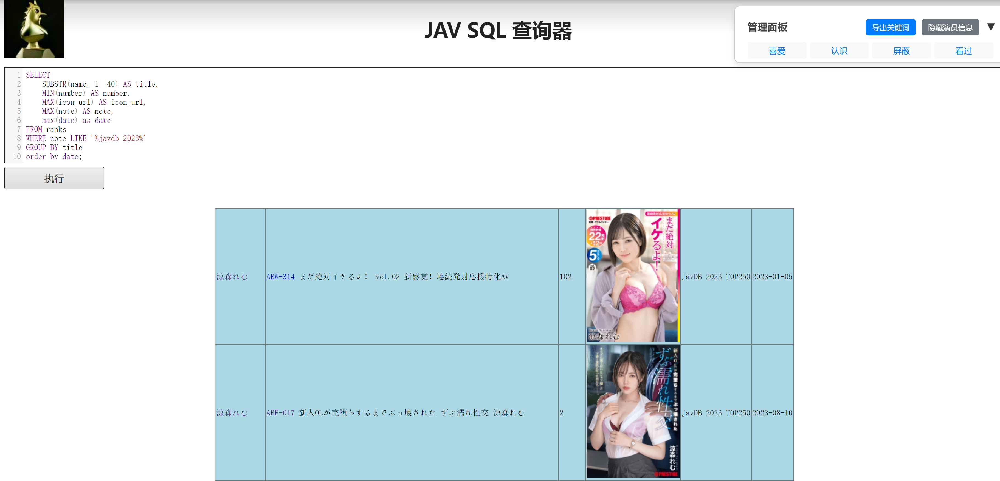

# JAV Manager

你是否常常在 JAVDB、JAVLibrary 等网站上挑选片子，却总是碰到看过的、或者不感兴趣的演员？
你是否期待能把 JAVLibrary 上标记的「喜欢」「看过」等信息，也同步到 JAVDB，帮你更方便地筛选好片？

**JAV Manager** 就是为此而生，帮助你一键整合和过滤多网站的观影记录与偏好，让你在最短时间内找到真正想看的内容

- 跨平台管理喜爱/看过/屏蔽/认识的演员
- 根据屏蔽/喜爱的演员，屏蔽/高亮影片，节省选片时间
- 自动爬取影片对应演员信息
- 可以根据演员信息/喜爱程度在页面内排序

使用<a href="https://chrome.google.com/webstore/detail/tampermonkey/dhdgffkkebhmkfjojejmpbldmpobfkfo" target="_blank">Tampermonkey</a>扩展插件来安装使用脚本，已经安装插件，可以点击<a href="https://www.tampermonkey.net/script_installation.php#url=https://raw.githubusercontent.com/some-anonymous-dev/Jav-manger/main/javmanager.js">直接安装</a>

https://greasyfork.org/zh-CN/scripts/522820-jav-manager

---

## 适用界面

- jinjier.art/sql 的所有界面（强烈推荐这个网站）
- javlibrary 的最想要和高评分页面
- javdb 除详情页和演员出演过的影片页面的所有界面

## 使用方法

- 在页面里面选中文本即可快速添加喜爱/认识/屏蔽/看过的关键词
- 也可批量导入，可参考 repo 中的 example_keywords.csv，直接复制某一列然后导入即可（该文件关键词仅代表个人爱好）
- 导入后会根据关键词自动屏蔽或者高亮喜爱的演员
- 对于第一次遇到的影片会自动爬取演员信息

---

## 使用效果

蓝色是看过，绿色是喜欢，认识是黄色，屏蔽的演员直接不出现（可以选择是否启用屏蔽）

---

## 注意事项

- 批量爬取演员信息时，请耐心等待脚本弹出的进度条
- 若遇到网络或访问限制，部分爬取源可能无法使用
- 更新脚本后如发现数据异常，建议先在管理面板中导出关键词，以防数据丢失

---

## License

本项目采用 [MIT License](./LICENSE) 进行开源，欢迎自由使用与修改。
